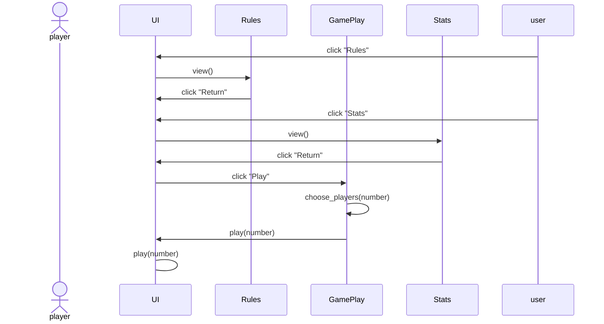

## Käyttöliittymä

Käyttöliittymään tulee aloitusnäkymä, josta voi valita sääntö- tai tilastonäkymän tai käynnistää pelin. 
Sääntö- ja tilastonäkymästä voi palata alkuun, mahdollisesti aloittaa uuden pelin. 
Uuden pelin valittuaan pelaaja valitsee, montako pelaajaa pelissä on. Tämän valinnan jälkeen peli käynnistyy

## Toiminta

Aloitusnäkymässä pelaaja valitsee, aloittaako pelin, katsooko säännöt (vai tilastot)



## Pelin kulku

Tietokoneet toimivat samalla lailla, tässä siis N voi olla mikä tahansa välillä 1-6, missä N merkkaa tietokoneen numeroa

```mermaid
 sequenceDiagram
	actor Player
	participant TableDeck
	participant Computer_N
	UI->>Player: check_hand(2 of clubs)
	Player->>UI: starter(Boolean)
	UI->>Computer_N: check_hand(2 of clubs)
	Computer_N->>UI: starter(Boolean)
	UI->>UI: starter(computer or player)
	UI->>Player(starter)
	Player->>UI: click "chosen card"
	UI->>tabledeck: add(chosen_card)
	alt when starting, has to be 2 of clubs
```
	
