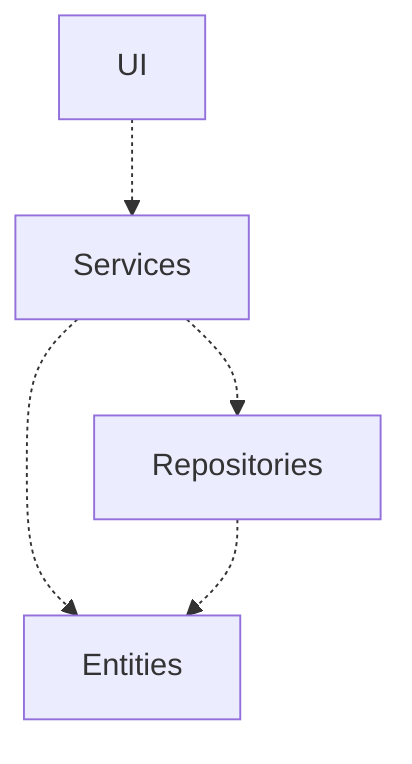
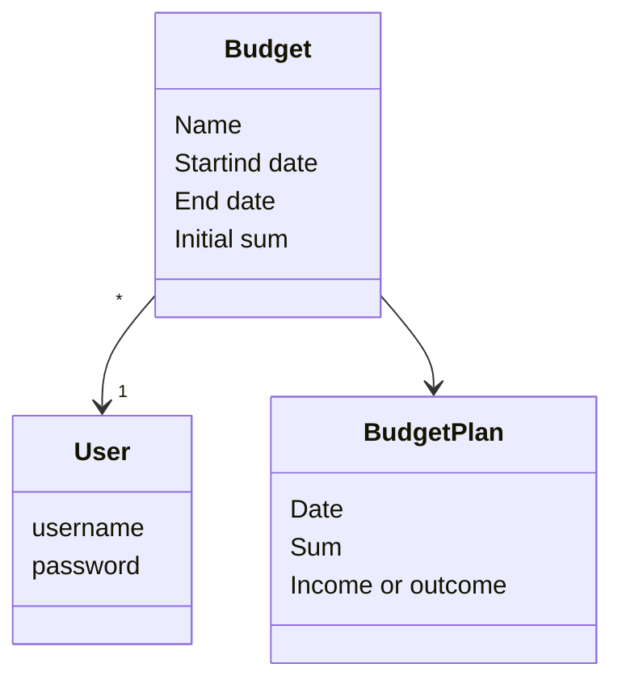
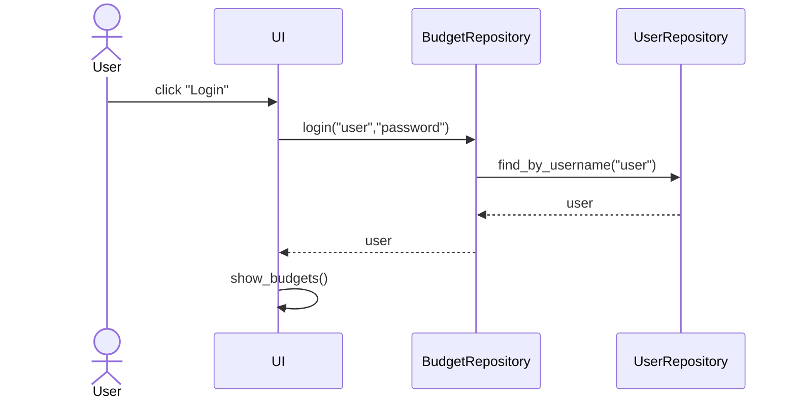
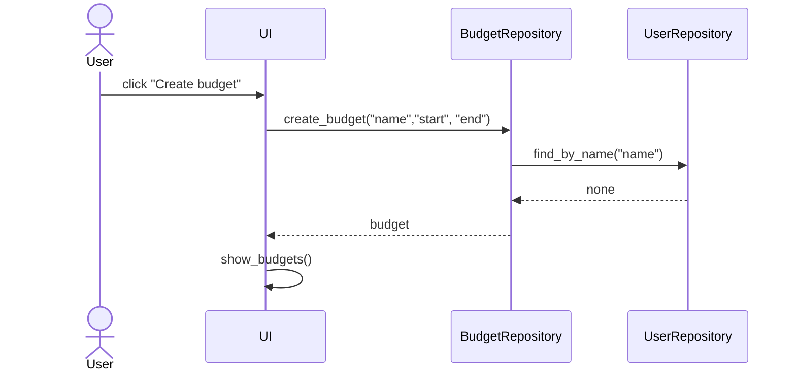
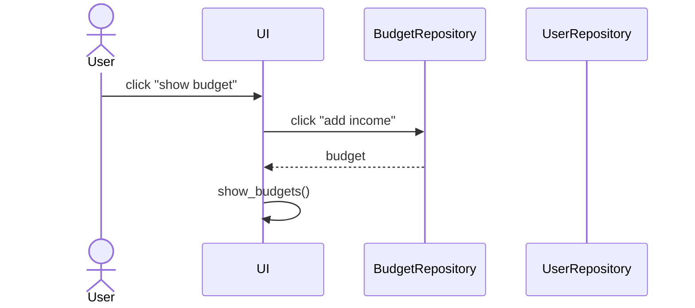

# Sovelluksen arkkitehtuuri

## Rakenne

Sovellus mukailee referenssinä olevan Todo-appin rakennetta, koska allekirjoittanut ei keksi parempaakaan toimintatapaa ja olettaa tämän olevan toimiva.

```mermaid
 flowchart TB;
      UI-.->Services 
      Services-.->Repositories 
      Services-.->Entities 
      Repositories-.->Entities 

```

## Käyttöliittymä

Käyttöliittymän näkymät ovat seuraavat: 
- Kirjautuminen
- Uuden käyttäjän luominen
- Uuden budjetin luominen kirjautuneelle käyttäjälle
- Budjettilistaus
- Yksittäinen budjetti

## Sovelluslogiikka

```mermaid
 classDiagram
      Budget "*" --> "1" User
      Budget --> BudgetPlan
      class User{
          username
          password
      }
      class Budget{
          Name
          Startind date
          End date
          Initial sum
      }
      class BudgetPlan{
          Date
          Sum
          Income or outcome
      }
```

## Tietojen tallennus

Repositories-pakkauksella on kaksi luokkaa: BudgetRepository ja UserRepository. 
Molemmat luokat tallentavat tiedostot SQLite-tietokantaan. 

## Päätoiminnallisuudet

### Kirjautuminen

```mermaid
 sequenceDiagram
      actor User
      participant UI
      participant BudgetRepository
      participant UserRepository
      User->>UI: click "Login"
      UI->>BudgetRepository: login("user","password")
      BudgetRepository->>UserRepository: find_by_username("user")
      UserRepository-->>BudgetRepository: user
      BudgetRepository-->>UI: user
      UI->>UI: show_budgets() 
```

### Budjetin luominen 

```mermaid
 sequenceDiagram
      actor User
      participant UI
      participant BudgetRepository
      participant UserRepository
      User->>UI: click "Create budget"
      UI->>BudgetRepository: create_budget("name","start", "end")
      BudgetRepository->>UserRepository: find_by_name("name")
      UserRepository-->>BudgetRepository: none
      BudgetRepository-->>UI: budget
      UI->>UI: show_budgets()
```

### Budjetin seuranta ja toteuttaminen

```mermaid
 sequenceDiagram
      actor User
      participant UI
      participant BudgetRepository
      participant UserRepository
      User->>UI: click "show budget"
      UI->>BudgetRepository: click "add income"
      BudgetRepository-->>UI: budget
      UI->>UI: show_budgets()
```

### Muut toiminnallisuudet

Budjettilistaus näyttää kaikki kyseisen käyttäjän budjetit. Tästä listauksesta on mahdollisuus valita yksittäinen budjetti syvempään tarkasteluun. 
