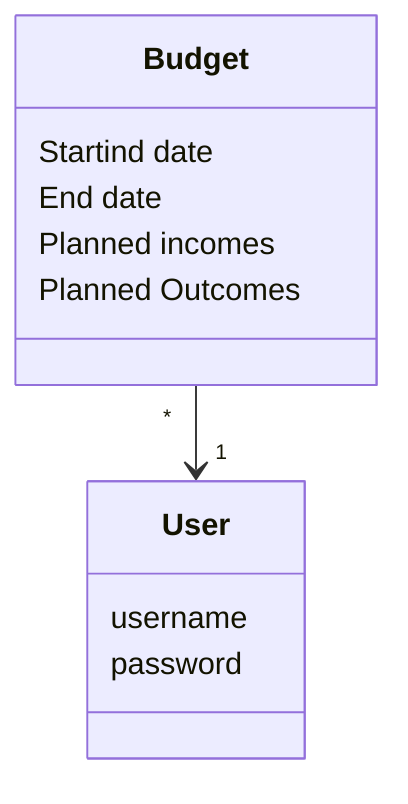

# Sovelluksen arkkitehtuuri

## Rakenne

## Käyttöliittymä

## Sovelluslogiikka

```mermaid
 classDiagram
      Budget "*" --> "1" User
      class User{
          username
          password
      }
      class Budget{
          Startind date
          End date
          Planned incomes
          Planned Outcomes
      }
```

## Tietojen tallennus

## Päätoiminnallisuudet

### Kirjautuminen

### Budjetin luominen 

### Budjetin seuranta ja toteuttaminen

### Muut toiminnallisuudet

