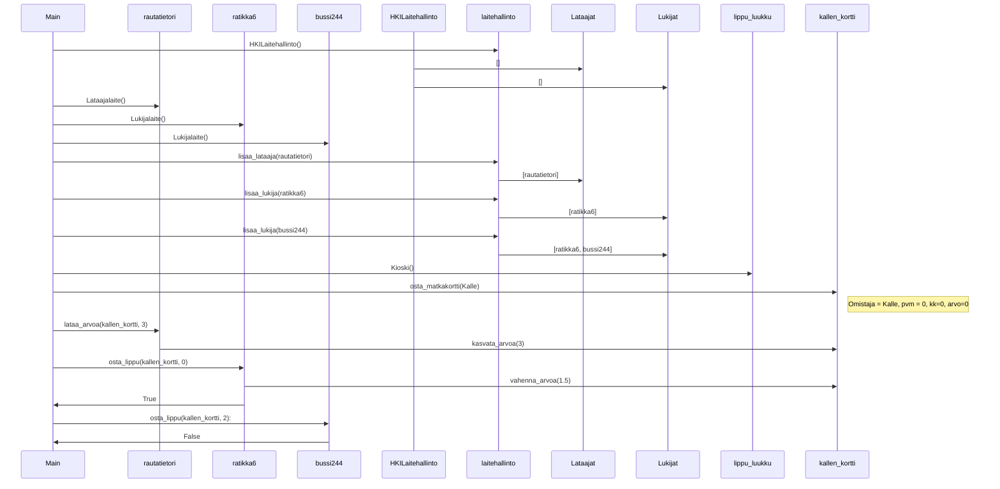

```mermaid
 sequenceDiagram
      participant M as Main
      participant RT as rautatietori
      participant R6 as ratikka6
      participant B244 as bussi244
      participant HKI as HKILaitehallinto
      participant L as laitehallinto
      participant LA as Lataajat
      participant LU as Lukijat
      participant LL as lippu_luukku
      participant KK as kallen_kortti
      M->>L: HKILaitehallinto()
      HKI->>LA: []
      HKI->>LU: []
      M->>RT: Lataajalaite()
      M->>R6: Lukijalaite()
      M->>B244: Lukijalaite()
      M->>L: lisaa_lataaja(rautatietori)
      L->>LA: [rautatietori]
      M->>L: lisaa_lukija(ratikka6)
      L->>LU: [ratikka6]
      M->>L: lisaa_lukija(bussi244)
      L->>LU: [ratikka6, bussi244]
      M->>LL: Kioski()
      M->>KK: osta_matkakortti(Kalle)
      Note right of KK: Omistaja = Kalle, pvm = 0, kk=0, arvo=0
      M->>RT: lataa_arvoa(kallen_kortti, 3)
      RT->>KK: kasvata_arvoa(3)
      M->>R6: osta_lippu(kallen_kortti, 0)
      R6->>KK: vahenna_arvoa(1.5)
      R6->>M: True
      M->>B244: osta_lippu(kallen_kortti, 2):
      B244->>M: False
```
