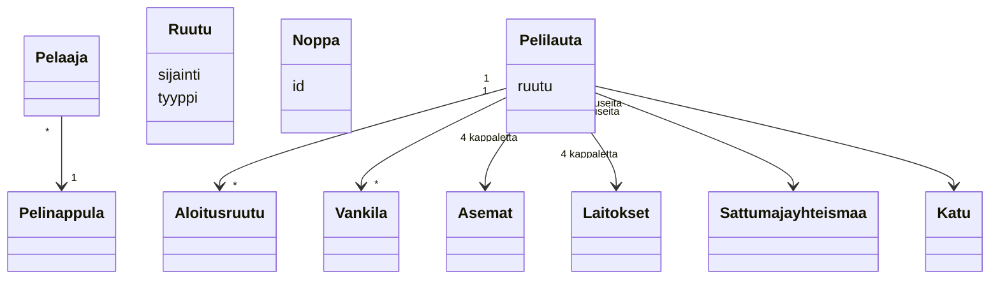

```mermaid
 classDiagram
      Pelaaja "*" --> "1" Pelinappula

      class Pelaaja{
          
      }
      class Ruutu{
          sijainti
          tyyppi
      }
      class Noppa{
          id
      }
      class Pelilauta{
          ruutu
      }
      Pelilauta "1" --> "*" Aloitusruutu
      Pelilauta "1" --> "*" Vankila
      Pelilauta "4 kappaletta" --> Asemat
      Pelilauta "4 kappaletta" --> Laitokset
      Pelilauta "useita" --> Sattuma ja yhteismaa
      Pelilauta "useita" --> Katu
      
```
