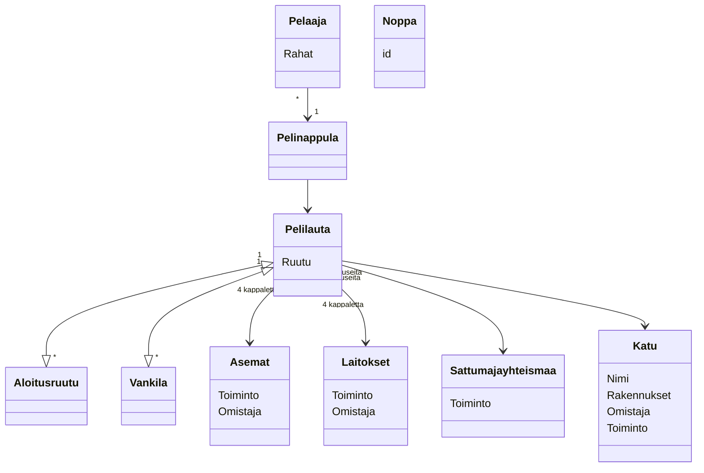

```mermaid
 classDiagram
      Pelaaja "*" --> "1" Pelinappula

      class Pelaaja{
      Rahat    
      }

      class Noppa{
          id
      }
      class Pelilauta{
          Ruutu
      }
      Pelilauta "1" <|--|> "*" Aloitusruutu
      Pelilauta "1" <|--|> "*" Vankila
      Pelilauta "4 kappaletta" --> Asemat
      Pelilauta "4 kappaletta" --> Laitokset
      Pelilauta "useita" --> Sattuma ja yhteismaa
      Pelilauta "useita" --> Katu
      Pelinappula --> Pelilauta
      class Katu{
      Nimi
      Rakennukset
      Omistaja
      Toiminto
      }
      class Sattuma ja yhteismaa{
      Toiminto
      }
      class Asemat{
      Toiminto
      Omistaja
      }
      class Laitokset{
      Toiminto
      Omistaja
      }
```
