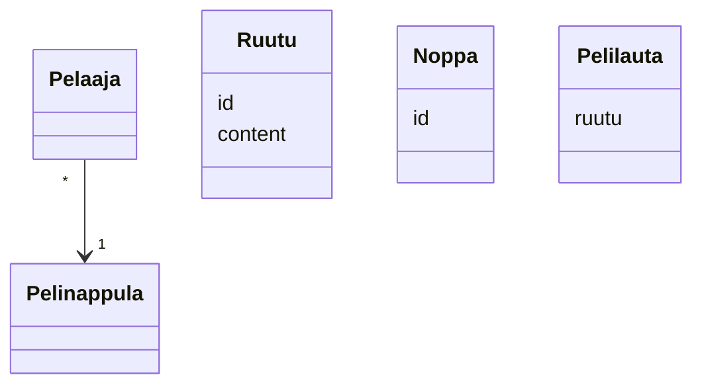

```mermaid
 classDiagram
      Pelaaja "*" --> "1" Pelinappula

      class Pelaaja{
          
      }
      class Ruutu{
          id
          content
      }
      class Noppa{
          id
      }
      class Pelilauta{
          ruutu
      }
```
