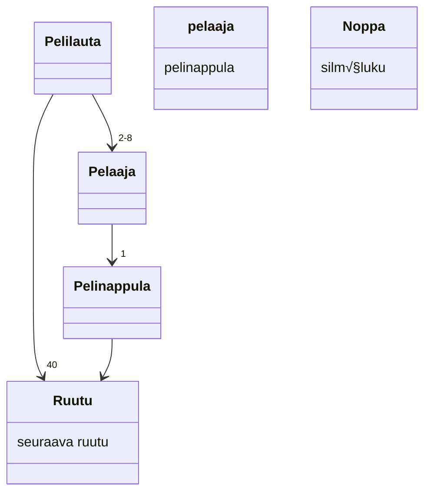

Monopoli-pelin toimintalogiikka

```mermaid
 classDiagram
 	Pelilauta --> "40" Ruutu
	Pelaaja --> "1" Pelinappula
	Pelinappula --> Ruutu
	Pelilauta --> "2-8" Pelaaja
	class Ruutu{
		seuraava ruutu
	}
	class pelaaja{
		pelinappula
	}
	class Noppa{
		silmäluku
	}
```
