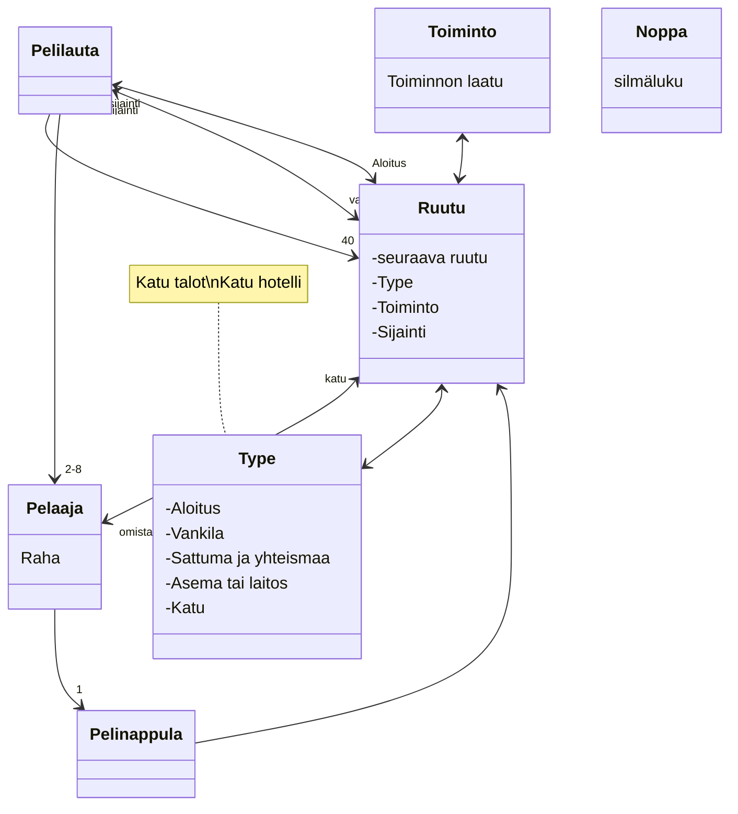

Laajennettu monopoli-pelin toimintalogiikka

```mermaid
 classDiagram
	note for Type "Katu talot\nKatu hotelli"
        Pelilauta --> "40" Ruutu
        Pelaaja --> "1" Pelinappula
        Pelinappula --> Ruutu
        Pelilauta --> "2-8" Pelaaja
	Ruutu "katu" <--> "omistaja" Pelaaja
	Ruutu <--> Type
	Toiminto <--> Ruutu
	Pelilauta "sijainti" <--> "vankila" Ruutu
	Pelilauta "sijainti" <--> "Aloitus" Ruutu
        class Ruutu{
                -seuraava ruutu
		-Type
		-Toiminto
		-Sijainti
        }
        class Noppa{
                silmäluku
        }
	class Type{
		-Aloitus
		-Vankila
		-Sattuma ja yhteismaa
		-Asema tai laitos
		-Katu
	}
	class Toiminto{
		Toiminnon laatu
	}
	class Pelaaja{
		Raha
	}
```
