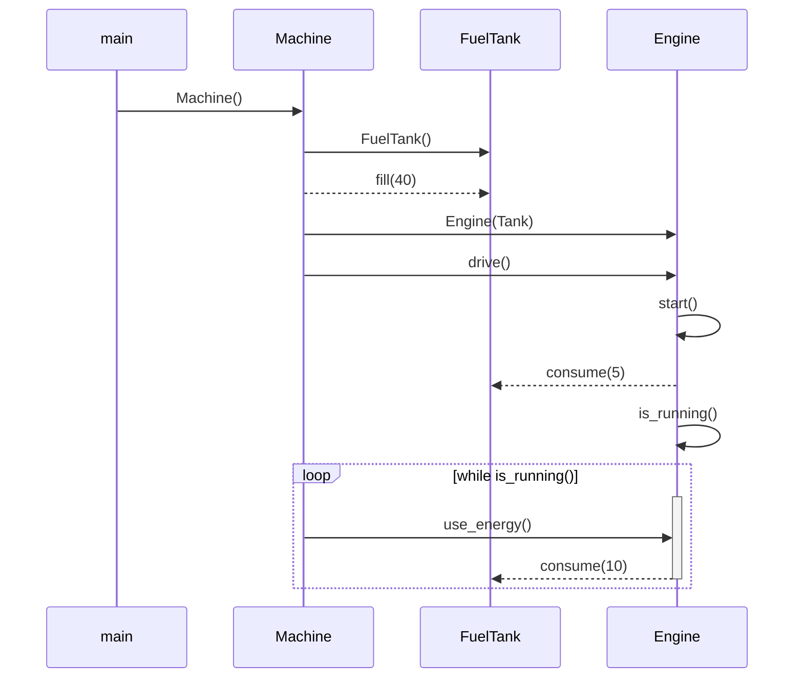

```mermaid
 sequenceDiagram
	main->>Machine: Machine()
	Machine->>FuelTank: FuelTank()
	Machine-->>FuelTank: fill(40)
	Machine->>Engine: Engine(Tank)
	
	Machine->>Engine: drive()
	Engine->>Engine: start()
	Engine-->>FuelTank: consume(5)
	Engine->>Engine: is_running()
	loop while is_running()
		activate Engine
		Machine->>Engine: use_energy()
		Engine-->>FuelTank: consume(10)
		deactivate Engine
	end

```
